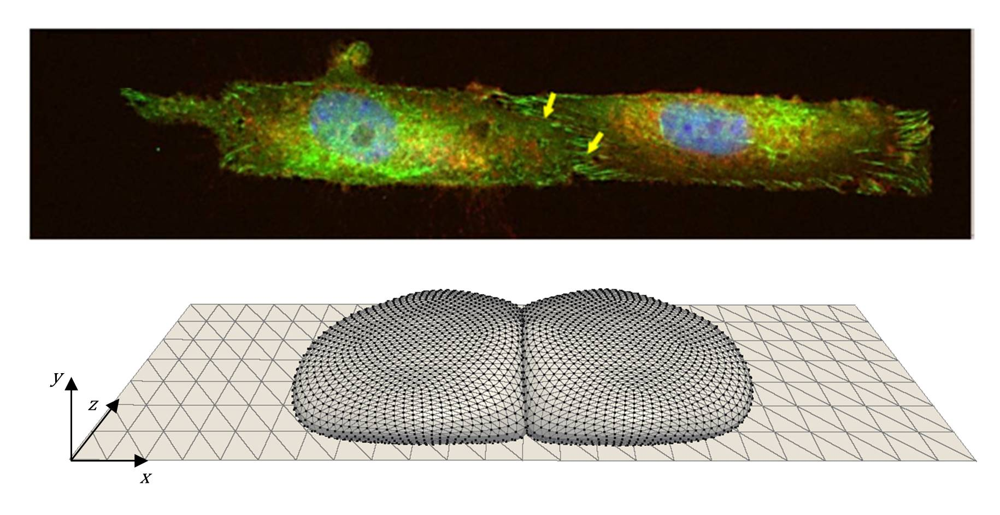
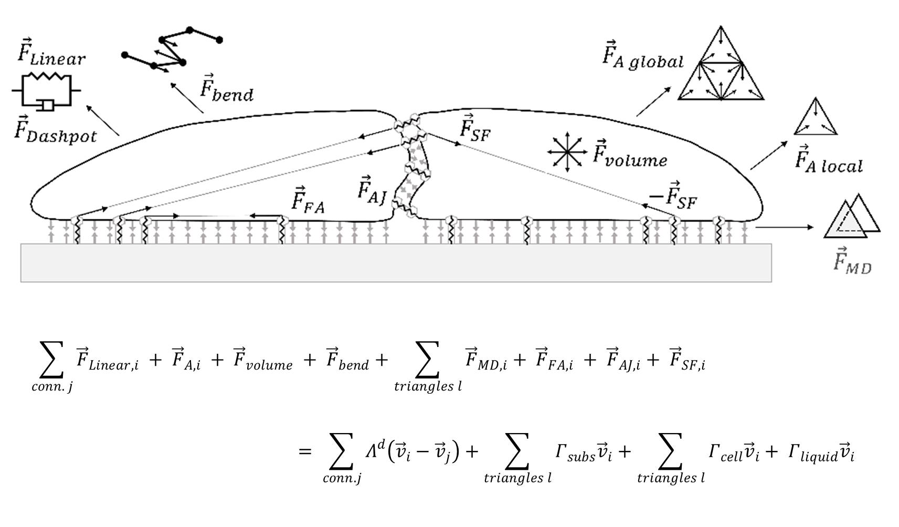
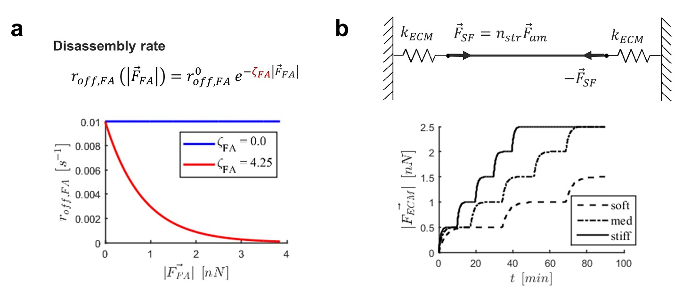
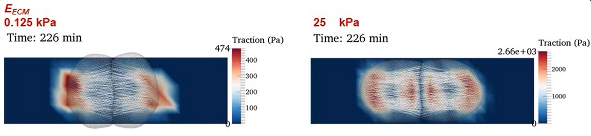

# Mechanical Model of a Cell Pair on a Surface: Balancing cell-cell and cell-substrate forces

The role of mechanobiology in different cellular processes spans multiple scales, from single protein, to macromolecular complexes, to cellular, to cell collectives.

Cells are sensitive to the mechanical properties of the surroundings, and understanding how cells sense this is crucial to understanding physiological and pathological processes.

This code was developed during a postdoctoral fellowship under the supervision of Prof. Hans Van Oosterwyck at KU Leuven between 2017 and 2020.

## About the Project

The simplest system that could be studied experimentally is a cell pair on a surface, constrained to a small surface area. The model was developed during a research stay at Prof. Harikrishnan Parameswaranat Northeastern University, who was peforming traction force microscopy (TFM) on a pair of airway smooth muscle (ASM) cells on a patterned deformable substrate.

The model recreated the experimental setup and provided a way to simulate distinct cytoskeletal and focal adhesion dynamics to explore their role in the balance of cell-cell and cell-substrate adhesions, adherens junctions and focal adhesions respectively.

 

**Figure 1** - (top) Airway smooth muscle cells on a micropattered substrate. Integrins (focal adhesions) are labeled green; beta catenin (adherens junctions) are labeled red. (bottom) Simulated recreation of cell pair.

This work can be found here:
*Vargas DA, Heck T, Smeets B, Ramon H, Parameswaran H, Van Oosterwyck H. Intercellular Adhesion Stiffness Moderates Cell Decoupling as a Function of Substrate Stiffness. Biophys J. 2020 Jul 21;119(2):243-257.*

And a video summary can be accessed on Youtube (https://www.youtube.com/watch?v=I8wq3xqL1_I).

## About the Model

### Cellular  Mechanics

The model was developed using the discrete element method (DEM), a particle-based method.It was used to represent both cells and the substrate via nodes. The DEM is meshless, and the bodies (i.e. cells and substrate plane) are built, however, by setting fixed connections between the particles (i.e. nodes) and creating surfaces in three dimensions formed by two-dimensional (2D) elements (i.e. triangular mesh).

 

**Figure 2** - (top) Cartoon depicting all the individual cellular components represented either by nodes or fibers. (bottom) Schematic of the forces that define the mechanical interactions.

### Subcellular Mechanics

Ligands in the extra-cellular matrix (ECM) are modeled as elastic springs with distinct stiffness (k_ECM), which is converted to a bulk stiffness (E_ECM).

The approach to determine formation of an focal adhesion (FA) at a node according to a binding rate is based on the knowledge that FAs are formed from reinforcement of integrin-ligand bonds once a stress fiber binds to it and applies force. A rate dictates how often adhesions are disassembled for FAs (r_off,FA,i) and AJs (r_off,AJ,i); however, this rate is made dependent on the magnitude of the force carried by the adhesion in such a way that force stabilizes the adhesion reducing the disassembly rate. This is the first way in which mechanosensing is accounted for in this model, and it is based on findings showing that multiprotein adhesion complexes are capable of mechanosensing and are stabilized by force through protein recruitment.

 

**Figure 3** - (left) Dependence of focal adhesion disassembly on force carried by ahesion complex with mechanosensing ON (red) and OFF (blue), and governing equation. (right) Resulting dynamics on a  simple system of a stress fiber with a single adhesion at each end: Over time, more force is exerted by actin fibers on stiffer substrates; the build-up of force is also faster on stiffer substrates.

### Simulations

Simulations were run varying two paramters:

- Substrate stiffness (k_ECM), using values: (1.0e-4 , 3.0e-4 , 5.0e-4 , 1.0e-3, 2.0e-3 , 3.0e-3 , 5.0e-3 , 1.0e-2, 2.0e-2 , 3.0e-2 , 5.0e-2 , 1.0e-1) [N/m]

- Factor describing mechanosensing by FAs (zeta_FA), using three conditions: zeta_FA > zeta_AJ , zeta_FA = zeta_AJ , zeta_FA < zeta_AJ

Simulations match experimental results.

 

**Figure 4** - On soft substrates, there are only adhesions at the edge of the cell pair; the cells act as a single dipole.  On stiffer substrates the cells decouple, each forming its own dipole with focal adhesions forming under the  cells on both ends.

The effect is much more pronounced with the mechanosensing mechanism for focal adhesion force reinforcement.

## About the Code

The files provided are required to reproduce simulations presented in the publication.

Work presented in this paper used Mpacts software (https://www.mpacts.com/), which is a closed-source software, originally developed by the MeBioS group at KU Leuven. The program consists of C++ modules for efficiency and size with Python acting as a glue language.

To ensure reproducibility at the time of publication, a Docker image (www.docker.com/) of the Mpacts platform had been provided. Docker allows recreation of exact runtime computational environment: a ready to be used Linux machine with Mpacts software and its dependencies installed in it.

Unfortunately, since publication the MeBioS group did not keep up the repository in which the Docker image was located. This possibly follows commertialization of Mpacts. Nonetheless, I share the code that conveys the methodical process of model development in C++ and Python.

#### Running the code

Running the simulation, would have required only starting the Docker image and entering in the command line:
*python multCellSpr.py*

The following sets of files are provided in this repository:

**a)** Simulation scripts (in folder *shared/cell_pair*):

Folder *shared* is indeed shared by the user’s machine and created Linux machine.

- *multCellSpr.py*:		Main simulation script to run simulation. Contains parameter definitions.

- *PyCmdsMultSim.py*:	Python functions additional to Mpacts commands used in main simulation script. It is called from multCellSpr.py

- *info.txt*:			Text file with a description of simulation scripts and paraview state file to visualize simulation output (vtp files).

The output of the simulations is in the form of vtp files and can be viewed by using visualization software such as Paraview  (www.paraview.org/). Users can change parameter values in simulation scripts to test simulation variants.

**b)** Sample post processing files are included in folder *post_processing*, since a single file is generated for selected time points to calculated quantitative output.

- *compute_metrics.py*:			(calculates output metrics for cell pair)
- *compute_metrics_cell_0.py*:	(calculates output metrics for single_cell)

- *assemble_data.py*:			(compiles, creates H5 file, for cell pair output)
- *assemble_data_cell_0.py*:	(compiles, creates H5 file, for cell 0)

**c)** Visualization

- *supplementary_videos.pvsm*: 	Paraview state file to visualize output (used to generate supplementary videos in publication).

**d)** Pertinent to Docker image generation:

- *reproduce.sh*:	A bash script that automates formation of the Docker image to hide underline technical complexities. Executing this bash should create a Linux machine, establish SSH connection to the machine, and will land user to a directory where simulation scripts are available.  

Note:

I created C++ modules for Mpacts, specific for the modeling of adhesrens junctions and focal adhesions as part of the Mpacts framework; however, these are not available to share.

## Improvements Implemented but not Shared

Generating data for the publication required running the code in a high performance cluster (HPC) setting.

This required making a factorial experimental (in silico) design, both fractional during exploratory simulations and full for the publication.
